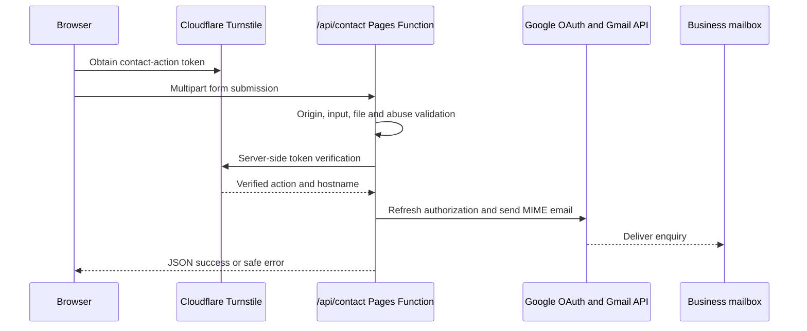

# Architecture

Last reviewed: 2026-09-02

## Stack and runtime contract

The declared runtime and dependency ranges are authoritative in [`package.json`](../package.json) and the exact dependency graph is locked in `package-lock.json`.

- Node.js 24 (`.nvmrc`; package engine `>=24 <25`) and npm 11 or later.
- Astro 7.1 with static output.
- TypeScript 6 with Astro strict mode, `exactOptionalPropertyTypes` and `noUncheckedIndexedAccess`.
- Tailwind CSS 4.3 through the Vite integration, plus project components in [`src/styles/global.css`](../src/styles/global.css).
- Cloudflare Pages for static delivery and Cloudflare Pages Functions for `/api/*`.
- Wrangler 4 for local Pages/Functions emulation and type generation.

## Rendering and deployment model

[`astro.config.ts`](../astro.config.ts) defines a static multipage build, file-format output and no trailing slashes. Every valid route has its own generated HTML file. There is no SPA fallback. [`public/_routes.json`](../public/_routes.json) sends only `/api/*` through Functions; all other paths are static Pages assets or Cloudflare's normal 404 handling.

Dynamic server-side behavior is deliberately limited to the Contact endpoint in [`functions/api/contact.ts`](../functions/api/contact.ts). Calculators run in the browser but their formulas and stored-payload validators are maintained as typed domain modules.

The sequence is documented in detail in [Contact Form](features/CONTACT_FORM.md).

## Repository map

| Path                                  | Responsibility                                                                                 |
| ------------------------------------- | ---------------------------------------------------------------------------------------------- |
| [`src/pages`](../src/pages)           | File-based static routes; thin page composition where typed data/components exist.             |
| [`src/components`](../src/components) | Shared UI, layouts-within-pages, navigation, SEO head, forms and calculator interfaces.        |
| [`src/layouts`](../src/layouts)       | Shared document shell and reusable service/article layouts.                                    |
| [`src/data`](../src/data)             | Typed English content, localized content, route/language, legal and business sources of truth. |
| [`src/i18n`](../src/i18n)             | Shared localized interface dictionaries and calculator/contact labels.                         |
| [`src/lib`](../src/lib)               | Reusable domain logic and validation, especially calculators.                                  |
| [`src/styles`](../src/styles)         | Global Tailwind import, tokens, component rules and responsive behavior.                       |
| [`scripts`](../scripts)               | Standard-library regression and documentation checks.                                          |
| [`functions`](../functions)           | Cloudflare Pages Function endpoint, validation, Turnstile and Gmail delivery helpers.          |
| [`public`](../public)                 | Copied static assets, images, crawler files and Cloudflare Pages routing/header files.         |
| [`.agents/skills`](../.agents/skills) | Repository-scoped Codex workflows.                                                             |

## Content architecture

Public pages use a pragmatic mix of typed data modules and Astro markup:

- Repeated or deeply localized content is generally held in `src/data`, with separate EN/ES/RU modules.
- Astro route files determine URL existence and compose layouts/components.
- Shared interface copy belongs in `src/i18n` when reuse and parity are important.
- Route existence and equivalence are independent concerns: a route file creates output, while [`src/data/navigation.ts`](../src/data/navigation.ts) records real translation groups for navigation, hreflang and the language switcher.

This is intentionally not a generic CMS abstraction. Add typed structures when repetition and validation justify them.

## Sources of truth

| Concern                                             | Source                                                                                                                                                                                                |
| --------------------------------------------------- | ----------------------------------------------------------------------------------------------------------------------------------------------------------------------------------------------------- |
| Supported locales                                   | [`src/data/languages.ts`](../src/data/languages.ts)                                                                                                                                                   |
| Route equivalents and primary navigation            | [`src/data/navigation.ts`](../src/data/navigation.ts)                                                                                                                                                 |
| Business/contact/service-area facts                 | [`src/data/site.ts`](../src/data/site.ts)                                                                                                                                                             |
| Legal/operator/retention status                     | [`src/data/legal.ts`](../src/data/legal.ts)                                                                                                                                                           |
| Shared document shell and Business schema inclusion | [`src/layouts/BaseLayout.astro`](../src/layouts/BaseLayout.astro)                                                                                                                                     |
| SEO metadata and stable Business ID                 | [`src/utils/seo.ts`](../src/utils/seo.ts) and [`src/components/SeoHead.astro`](../src/components/SeoHead.astro)                                                                                       |
| Hreflang equivalence                                | [`src/utils/hreflang.ts`](../src/utils/hreflang.ts)                                                                                                                                                   |
| Pre-purchase calculator                             | [`src/lib/calculators/prePurchaseSurvey.ts`](../src/lib/calculators/prePurchaseSurvey.ts)                                                                                                             |
| Delivery calculator and graph                       | [`src/lib/calculators/yachtDelivery.ts`](../src/lib/calculators/yachtDelivery.ts) and [`src/data/calculators/mediterraneanDeliveryRoutes.ts`](../src/data/calculators/mediterraneanDeliveryRoutes.ts) |
| Contact endpoint                                    | [`functions/api/contact.ts`](../functions/api/contact.ts) and [`functions/_lib`](../functions/_lib)                                                                                                   |
| Survey Tips types, order and article data           | [`src/data/yacht-survey-tips`](../src/data/yacht-survey-tips), localized sibling folders and hub data modules                                                                                         |

## Related architecture

- [Content and Localisation](CONTENT_AND_LOCALISATION.md)
- [SEO and Indexing](SEO_AND_INDEXING.md)
- [Security and Secrets](SECURITY_AND_SECRETS.md)
- [Architecture Decision Records](adr/README.md)
