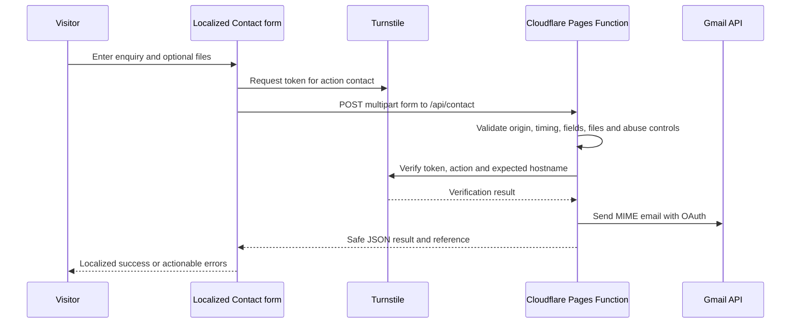

# Contact form

Last reviewed: 2026-09-02

## Purpose and scope

The Contact feature provides one EN/ES/RU enquiry workflow while keeping validation, anti-abuse and email delivery on the server. The public pages are `/contact`, `/es/contact` and `/ru/contact`; all post to `/api/contact`.

Relevant sources:

- UI and browser handoff: [`src/components/ContactForm.astro`](../../src/components/ContactForm.astro).
- Localized interface copy: [`src/i18n/contact.ts`](../../src/i18n/contact.ts).
- Canonical service values: [`src/utils/contact.ts`](../../src/utils/contact.ts).
- Pages Function: [`functions/api/contact.ts`](../../functions/api/contact.ts).
- Validation, Turnstile and Gmail: [`functions/_lib`](../../functions/_lib).

## Request flow

## Canonical payload

Service values remain canonical across locales:

- `pre-purchase-survey`
- `insurance-survey`
- `buyer-representation`
- `yacht-delivery`
- `valuation-damage-survey`
- `general-enquiry`

Do not translate these codes. Localized labels are presentation only. The form also submits `locale`, source/page context and, when valid, a calculator reference and summary. Visitor text remains as submitted.

## Validation and privacy

Browser validation provides localized feedback; the server repeats authoritative checks. Required elements include a valid name/email, a 20–5,000-character message, form-session timing, Turnstile token and Privacy Policy acknowledgement. Optional phone, vessel, date and location fields are bounded and normalized.

The acknowledgement means the visitor has read the localized Privacy Policy and understands enquiry handling. It is not universal consent. A Contact or policy change must keep EN/ES/RU links and wording aligned with actual processing.

## Attachments

- At most three files.
- At most 2 MB per file.
- At most 3 MB combined; overall request limit is 4.5 MB.
- PDF, JPEG, PNG and WebP only.
- MIME type, extension and binary signature must agree.
- Filenames are normalized, control/path characters removed and length bounded.

Do not loosen these limits independently in the browser, server, policies or tests. The current validation is not an antivirus scanner; do not claim otherwise.

## Abuse and security controls

- same-origin and multipart-only requests;
- hidden honeypot with success-like response;
- valid form age (minimum two seconds, maximum four hours);
- server-side Turnstile verification for action `contact` and allowed hostnames;
- SHA-256-derived IP cache key and 60-second rate interval;
- 24-hour submission-ID deduplication;
- no-store API responses;
- sanitized, limited metadata logs without enquiry body or credential values.

See [Security and Secrets](../SECURITY_AND_SECRETS.md).

## Gmail delivery

The Function uses stored Google OAuth credentials to obtain a short-lived access token and calls the Gmail send API. It creates multipart plain-text/HTML email and optional attachment parts. `From` is the configured website sender, `To` is the business mailbox, and `Reply-To` is the validated visitor name/email. Successful responses include the generated `AYS-...` reference.

Browser-facing errors distinguish invalid input, verification, rate limit and temporary email failure without exposing provider details. Direct phone, WhatsApp and email remain visible alternatives.

## Calculator handoff

A calculator stores a versioned estimate in `sessionStorage`, then links to the localized Contact route with a service/source/reference query. Contact reads only the matching storage key, validates age, shape and reference, recomputes the canonical result and then creates a localized display summary. Invalid or expired data is removed and never trusted as a quotation.

The legacy `ays:contact-prefill` key is read/remove compatibility input only; current code does not write it.

## Operational dependencies

Names only:

- `PUBLIC_TURNSTILE_SITE_KEY`
- `TURNSTILE_SECRET_KEY`
- `TURNSTILE_EXPECTED_HOSTNAMES`
- `CONTACT_FROM_EMAIL`
- `CONTACT_TO_EMAIL`
- `GOOGLE_OAUTH_CLIENT_ID`
- `GOOGLE_OAUTH_CLIENT_SECRET`
- `GOOGLE_OAUTH_REFRESH_TOKEN`

Production requires a matching Turnstile widget/hostname configuration and Gmail authorization. Never put private values in public build variables.

### Provisioning checklist

1. Use the approved Google Cloud project for the existing Google Workspace mailbox and enable the Gmail API.
2. Create a server-side OAuth client and authorize the mailbox for offline access using only the Gmail send scope.
3. Put the OAuth values in encrypted Cloudflare secrets; never paste them into source, docs or public variables.
4. Create/configure the Turnstile widget for the exact production and intended preview hostnames.
5. Configure the public widget key at build time and the server key/expected hostnames at runtime in each relevant Cloudflare environment.
6. Verify the Turnstile widget mode, hostname allowlist, pre-clearance and other dashboard-only settings in Cloudflare; repository code cannot prove them.
7. Regenerate Function binding types when binding names change.

This Gmail API implementation does not require changing the domain's MX, SPF or DKIM records merely to send through the already-authorized mailbox.

## Change validation

Run the current scripts documented in [Testing and Quality](../TESTING_AND_QUALITY.md), with emphasis on Function typecheck, lint, legal/storage regression, EN/ES/RU validation and both build modes. For a behavior change, use Cloudflare local preview and, only when configured/authorized, a controlled delivery test. Verify Reply-To, attachments, localized errors, success reference and sanitized logs.
